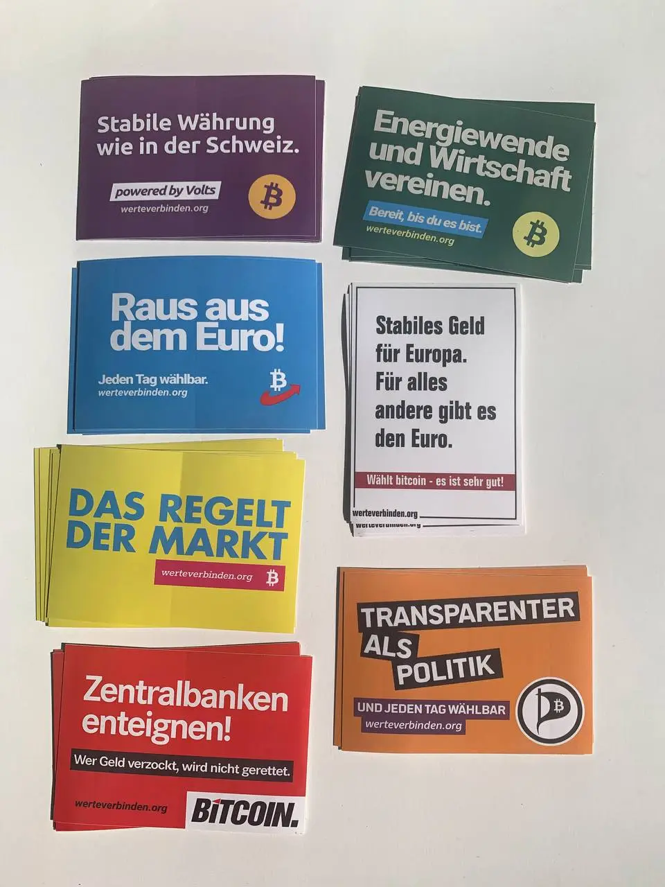

# werte verbinden

Geld ist so ein Thema worüber man nicht spricht. Ich will das ändern.

Das Projekt besteht aus Stickern, die rein zufällig so aussehen wie die Poster von deutschen Parteien. Diese Seite soll zeigen, dass Bitcoin ein Thema ist, was jede Ideologie betrifft.

## Projekt unterstützen

Es gibt mehrere Wege, das Projekt zu supporten:

1. Sticker kleben - aktuell in Darmstadt abholbar, verschicken kann ich die bestimmt auch, hab ich mir aber noch keine Gedanken zu gemacht wie ich das am besten organisiere.

2. Website verbessern - Die Seite ist hier und da noch etwas hakelig, da ich mich für die anstehende Wahl etwas beeilen musste. Verbesserungsvorschläge zu Text und Design sind in Form von Pull Requests gerne gesehen!

3. Spenden - Ich habe insgesamt 874.546 sats für den Druck der Sticker ausgegeben. Darin enthalten ist nicht die Domain, und die Arbeit die ich reingesteckt habe auch nicht. Ich mag das ja auch irgendwo zum Spaß.

- Onchain: `BC1Q37A3Q3F3ZSJLXZKVMYER3M2D8PJL0G4V05KDXX`
- Lightning: per LNTXBOT an `@lumsdnb` auf Telegram
